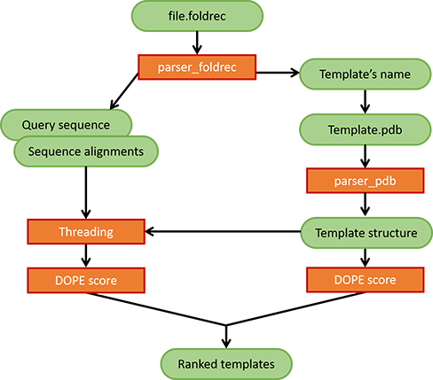

## FlowChart (1/2)

Already processes all possible alignments in the foldrec file. Threading is computed on all the templates (not only one) and the DOPE score is calculated for each couple template/threading.

## FlowChart (2/2)



## Data structure (1/2)

Dictionaries of dictionaries wrapped with class objects for easier handeling

Example of class:

```python
def __init__(
            self: 'Atom',
            x: float, y: float, z: float,
            element: str,
            atom_num: int,
            ) -> None:
    self.coord = np.array([x, y, z])
    self.element = element
    self.atom_num = atom_num
```

## Data structure (2/2)

Example of functions defined in the object:

```python
def get_seq(self: 'Chain'):
    """
    Return chain sequence as a string of 1 letter coded AA.
    """
    seq = str()
    for res in self.residues.values():
        try:
            seq += three2one[res.res_name]
        except KeyError:
            seq += 'X'
    return seq
```

=> class function make things faster (Antoine's argument)

## Parsing foldrec and sequence threading

`.foldrec` files are parsed and return a dictionary that can be easily used for threading: `{align_struct: list of tupes (query residue name, template residue number)}`

## Threading of query's CA on template's CA

Threading of query's CA on template's CA. Writes a pdb file that we can open with PyMol.

*Il serait bien de le montrer et d'avoir une image pymol ici.*

## DOPE score

Sum of statistical potentials between pairs of residues (CA of residues only for now).

Calculated on template and query => Using a "ratio" to compare the increase of the score from Template to threading and choose the best template(s), i.e. smallest decrease.

## Technical goals

### Fast computing and execution

Partially fulfilled: dedicated class objects, mostly working with dictionaries (protein strutures, dope.par), limited number of lists and iterations

### Reliable (Accurate, error free, readable)

Partially fulfilled: Circle CI, pytest, Yvan

### Flexible (adapted to several situations)

Partially fulfilled: pdb parser ran on all homery.foldrec templates, MSE residue exeption handled, etc.

## Conclusion

### Short term improvements

Re-weighting DOPE scores(Sequence coverage, gaps in query, etc.)

### Long term improvements

We want to implement the largest number of promising methods to get several scores and find a final score using ML methods that best predict the closest template.
